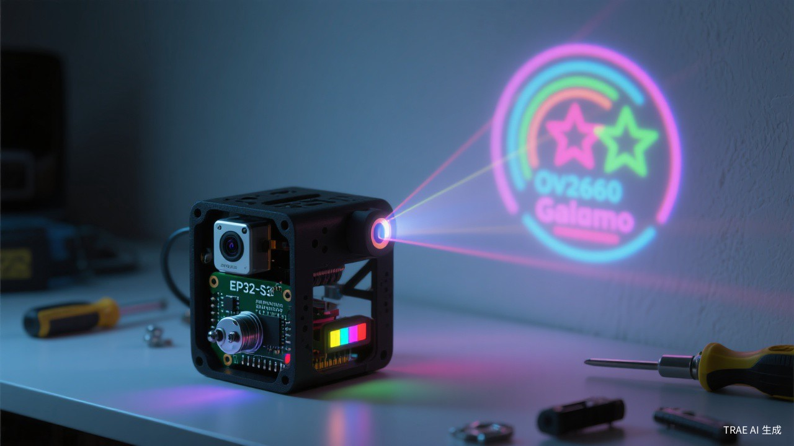
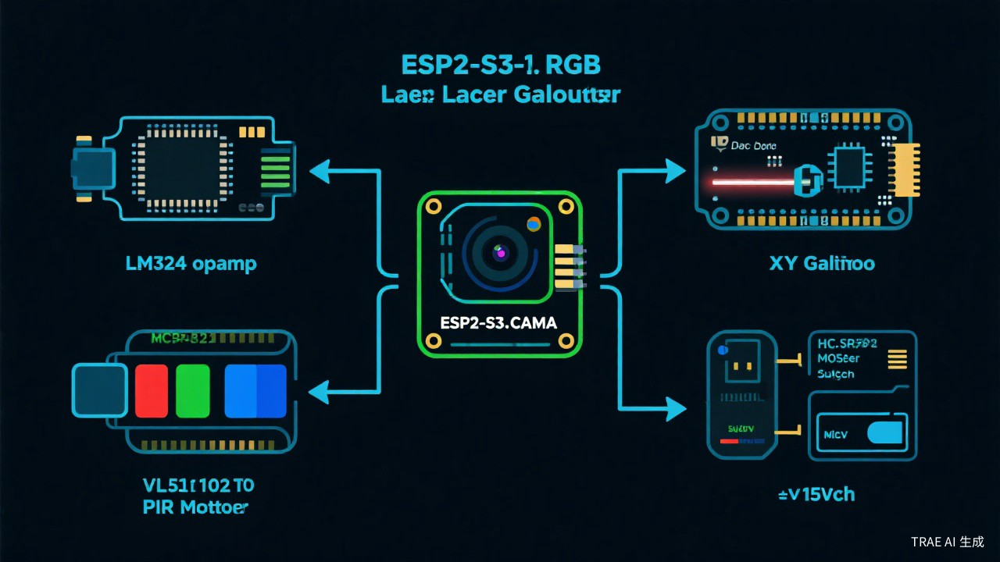
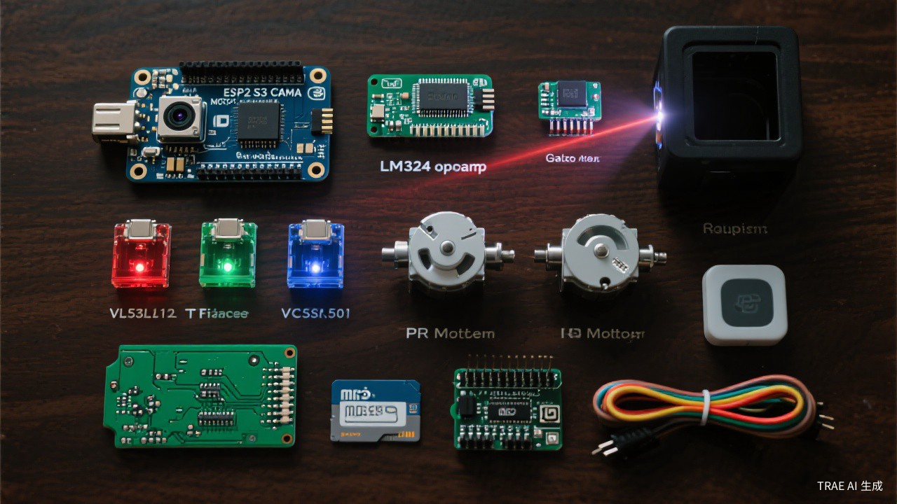
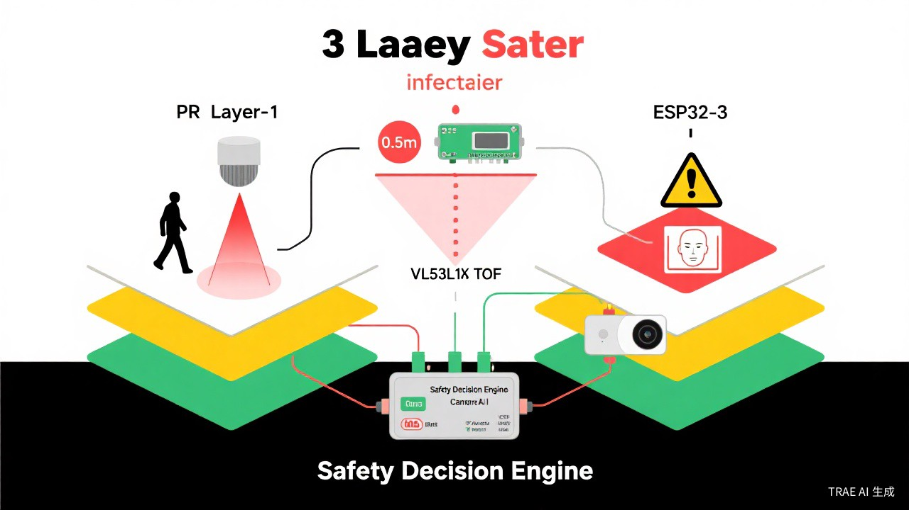
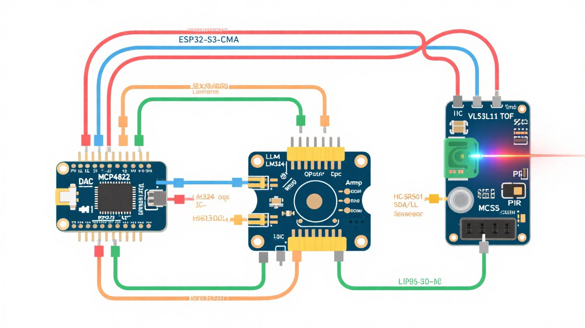

# GalvoEye-S3: ESP32-S3 AI 智能振镜投影仪

<p align="center">
  
</p>

<p align="center">
  <strong>基于 ESP32-S3 的矢量激光投影仪</strong> · YOLO 目标跟踪 · 交互式激光按钮 · 三重安全保护
</p>

<p align="center">
  <a href="#功能特性">功能特性</a> · <a href="#系统架构">系统架构</a> · <a href="#快速开始">快速开始</a> · <a href="#物料清单">物料清单</a> · <a href="#组装教程">组装教程</a> · <a href="#安全说明">安全说明</a>
</p>

---

## 📢 项目说明

**GalvoEye-S3** 是基于 [bbLaser](https://github.com/RealCorebb/bbLaser)（by [Corebb](https://github.com/RealCorebb)）的衍生项目。在原版基础上进行了以下重大升级：

| 升级项 | 原版 bbLaser | GalvoEye-S3 |
|--------|-------------|------------|
| 主控 | ESP32 | **ESP32-S3**（双核 240MHz + 8MB PSRAM） |
| 视觉能力 | 无 | **内置摄像头 + ESP-DL 人脸检测（可选）** |
| 目标跟踪 | 无 | **YOLOv8 目标检测 + 实时跟踪（PC 端）** |
| 交互能力 | 仅 SD 卡播放 | **交互式激光按钮 + 手指点击检测** |
| 安全保护 | 无 | **双层安全保护（PIR + ToF），ESP-DL 人脸检测为高级可选** |
| 通信 | WebSocket | **WebSocket + 双模式 WiFi** |
| 成本 | 需 PC 辅助 | **纯嵌入式，无需 PC（约 ¥160~500）** |

> ⚠️ 本项目遵循 **CC-BY-NC-SA 3.0** 协议，仅限非商业用途。

---

## ✨ 功能特性

### 🔴 矢量激光投影
- RGB 三色激光投射（红 650nm / 绿 520nm / 蓝 450nm）
- 支持矢量图形绘制（点、线、圆、矩形、文字）
- 支持 ILDA 标准文件播放（SD 卡离线播放）
- WiFi 实时串流控制

### 🎯 "指哪打哪"目标跟踪
- **双模式 AI 方案**:
  - ESP32-S3 端: ESP-DL 人脸检测（轻量级，用于安全保护，可选配置）
  - PC 端: YOLOv8 高精度目标检测（用于实时目标跟踪）
- 选择双模式方案的原因: ESP32-S3 算力有限，无法运行高精度 YOLO 模型；ESP-DL 人脸检测经过专门优化，可在 ESP32-S3 上实时运行，适合安全保护场景；而 YOLOv8 在 PC 端运行可提供更高的检测精度和更丰富的目标类别支持
- 摄像头-振镜坐标系自动标定
- 目标实时跟踪（平滑插值）
- 支持自定义检测模型

### 👆 交互式激光按钮
- 激光投射按钮形状（圆形/矩形）
- 手指检测 + 运动检测判断点击
- 多按钮管理
- 点击事件回调

### 🛡️ 双层安全保护
- **第一层**：PIR 人体感应（检测范围 3~7 米）
- **第二层**：VL53L1X ToF 精确测距（< 0.5 米自动关闭）
- **第三层（高级可选）**：ESP-DL 人脸检测（直视自动关闭，需额外配置 ESP-DL 模型）
- **硬件层**：MOSFET 总开关（软件崩溃也能保护）
- **安全恢复机制**：从危险/紧急状态恢复时，需用户确认（长按按钮或 WebSocket 指令）才能回到正常工作状态
- **当前版本**：主要依赖 PIR + ToF 双层保护，ESP-DL 人脸检测为高级可选功能

---

## 🏗️ 系统架构

<p align="center">
  
</p>

```
┌──────────────────────────────────────────────────────┐
│                    ESP32-S3 (核心)                     │
│                                                      │
│  ┌──────────┐  ┌──────────┐  ┌──────────┐           │
│  │ OV2640   │  │ ESP-DL   │  │ DAC      │           │
│  │ 摄像头   │→│ 人脸检测  │→│ MCP4822  │→ 振镜驱动  │→ 振镜+激光
│  │ (CSI)    │  │ (可选)   │  │ (SPI)    │           │
│  └──────────┘  └──────────┘  └──────────┘           │
│                                                      │
│  ┌──────────┐  ┌──────────┐                          │
│  │ VL53L1X  │  │ PIR      │  ← 安全保护双保险        │
│  │ ToF测距  │  │ 人体感应  │  (ESP-DL 为高级可选)     │
│  └──────────┘  └──────────┘                          │
└──────────────────────────────────────────────────────┘
```

### PC 端协作模式（可选）

当需要 YOLO 高精度目标检测时，可连接 PC 端软件：

```
PC (Python)                          ESP32-S3
┌─────────────┐    WebSocket    ┌──────────────┐
│  摄像头采集  │ ──────────────→ │  接收坐标     │
│  YOLO 检测   │ ←────────────── │  DAC 输出     │
│  坐标映射   │                  │  振镜控制     │
│  按钮交互   │                  │  安全保护     │
└─────────────┘                  └──────────────┘
```

---

## 📦 物料清单

<p align="center">
  
</p>

### 成本方案

| 方案 | 配置 | 总成本 |
|------|------|--------|
| **极致省钱版** | ESP32-S3-CAM + 入门振镜 + 单红激光 + 基础安全 | **约 ¥150~250** |
| **推荐均衡版** ⭐ | ESP32-S3-CAM + 20K 振镜 + RGB 激光 + 三重安全 | **约 ¥300~500** |
| **品质版** | LILYGO T-Camera-S3 + 金海创振镜 + RGB 激光 + 完整安全 | **约 ¥600~900** |

### 分批购买建议

**第一批（先跑通基础功能）约 ¥150：**

| 物品 | 价格 |
|------|------|
| ESP32-S3-CAM N8R8 + OV2640 | ¥28 |
| MCP4822 + LM324 + 阻容（立创 BOM） | ¥15 |
| PCB 打样（嘉立创免费） | ¥0 |
| 入门振镜套装 + 驱动板 | ¥80 |
| 红色激光模组 5mW | ¥5 |
| HC-SR501 PIR 传感器 | ¥3 |
| MOSFET 开关模块 | ¥3 |
| 电源 + 线材 | ¥15 |

> 📋 完整 BOM 清单请查看 [docs/BOM.md](docs/BOM.md)

---

## 🚀 快速开始

### 前置要求

- [PlatformIO](https://platformio.org/)（ESP32 固件开发）
  - 推荐通过 [VS Code 扩展](https://marketplace.visualstudio.com/items?itemName=platformio.platformio-ide) 安装 PlatformIO IDE
  - 首次安装需要下载 ESP32 工具链（约 500MB），请确保网络畅通
  - Windows 用户需要提前安装 [CH340/CP2102 USB 驱动](https://docs.platformio.org/en/latest/faq.html#platformio-udev-rules)
- [Python 3.9+](https://www.python.org/)（PC 端软件，可选）
- 万用表
- 830 孔面包板 + 杜邦线（无需焊接）

### 五步上手

```bash
# 1. 克隆仓库
git clone https://github.com/960208781/GalvoEye-S3.git
cd GalvoEye-S3

# 2. 烧录固件
cd firmware
pio run -t upload

# 3. 连接 WiFi
# 设备会创建热点 "GalvoEye-S3"，密码 "12345678"
# 或在代码中修改 WiFi 账号密码

# 4. （可选）安装 PC 端软件
cd ../software
pip install -r requirements.txt

# 5. 运行标定
# 前置条件：PC 已连接到 GalvoEye-S3 WiFi 热点，PC 摄像头可用
python main.py --mode calibrate
```

### 详细教程

| 文档 | 说明 |
|------|------|
| [📦 物料清单](docs/BOM.md) | 完整采购清单 + 购买链接 |
| [🔌 接线说明](docs/WIRING.md) | 所有模块的接线方法 |
| [🔧 PCB 修改](docs/PCB_MODIFY.md) | 基于原版 PCB 的修改方案 |
| [📖 组装教程](docs/ASSEMBLY_GUIDE.md) | 从零到完成的完整教程 |
| [🛡️ 安全说明](docs/SAFETY.md) | 激光安全注意事项 |
| [💻 PC 端软件](software/README.md) | Python 控制软件使用说明 |

---

## 📁 项目结构

```
GalvoEye-S3/
├── firmware/                    # ESP32-S3 固件（PlatformIO）
│   ├── platformio.ini          # PlatformIO 配置
│   └── src/
│       ├── main.cpp            # 主程序入口
│       ├── pin_defs.h          # 引脚定义
│       ├── dac_controller.h    # MCP4822 DAC 控制器
│       ├── safety_system.h     # 安全保护系统
│       ├── websocket_handler.h # WebSocket 通信
│       └── ilda_player.h       # ILDA 文件播放器
│
├── software/                    # PC 端 Python 软件（可选）
│   ├── requirements.txt        # Python 依赖
│   ├── main.py                 # 主程序入口
│   ├── config.py               # 配置文件
│   ├── calibrator.py           # 坐标标定模块
│   ├── detector.py             # YOLO 目标检测
│   ├── communicator.py         # WebSocket 通信
│   ├── interactive.py          # 交互式激光按钮
│   └── README.md               # PC 端使用说明
│
├── docs/                        # 文档
│   ├── images/                 # 图片资源
│   │   ├── system_architecture.jpg   # 系统架构图
│   │   ├── wiring_diagram.jpg        # 接线示意图
│   │   ├── components_overview.jpg   # 物料一览图
│   │   ├── final_product.jpg         # 成品效果图
│   │   └── safety_system.jpg         # 安全系统示意图
│   ├── BOM.md                # 物料清单
│   ├── WIRING.md             # 接线说明
│   ├── PCB_MODIFY.md         # PCB 修改说明
│   ├── ASSEMBLY_GUIDE.md     # 组装教程
│   └── SAFETY.md             # 安全说明
│
├── LICENSE                     # CC-BY-NC-SA 3.0 协议
├── .gitignore                  # Git 忽略规则
└── README.md                   # 本文件
```

---

## 🛡️ 安全说明

<p align="center">
  
</p>

> ⚠️ **激光安全是第一优先级！**

- 本项目使用 **≤5mW Class IIIa** 激光器
- 内置 **双层安全保护**（PIR + ToF），ESP-DL 人脸检测为高级可选功能
- **MOSFET 硬件层总开关**，即使软件崩溃也能切断激光
- **安全恢复需用户确认**，防止危险状态自动恢复
- **严禁**直视激光束或将其对准人眼/动物
- 有儿童的环境请务必启用全部安全功能

详细安全说明请查看 [docs/SAFETY.md](docs/SAFETY.md)

---

## 🔧 接线参考

<p align="center">
  
</p>

详细接线说明请查看 [docs/WIRING.md](docs/WIRING.md)

---

## 🙏 致谢

- **[Corebb](https://github.com/RealCorebb)** - 原版 [bbLaser](https://github.com/RealCorebb/bbLaser) 项目
- **[Espressif](https://www.espressif.com/)** - ESP32-S3 芯片
- **[Ultralytics](https://github.com/ultralytics/ultralytics)** - YOLOv8 目标检测
- **[PlatformIO](https://platformio.org/)** - 嵌入式开发框架

---

## 📄 开源协议

本项目基于 [bbLaser](https://github.com/RealCorebb/bbLaser)（by Corebb）衍生，遵循 **CC-BY-NC-SA 3.0** 协议。

- ✅ 个人学习和研究
- ✅ 非商业用途分享和修改
- ❌ 商业用途
- ❌ 移除原作者署名

详见 [LICENSE](LICENSE) 文件。

---

<p align="center">
  <sub>⚠️ 使用本项目的风险由使用者自行承担，请务必遵守激光安全规范</sub>
</p>
